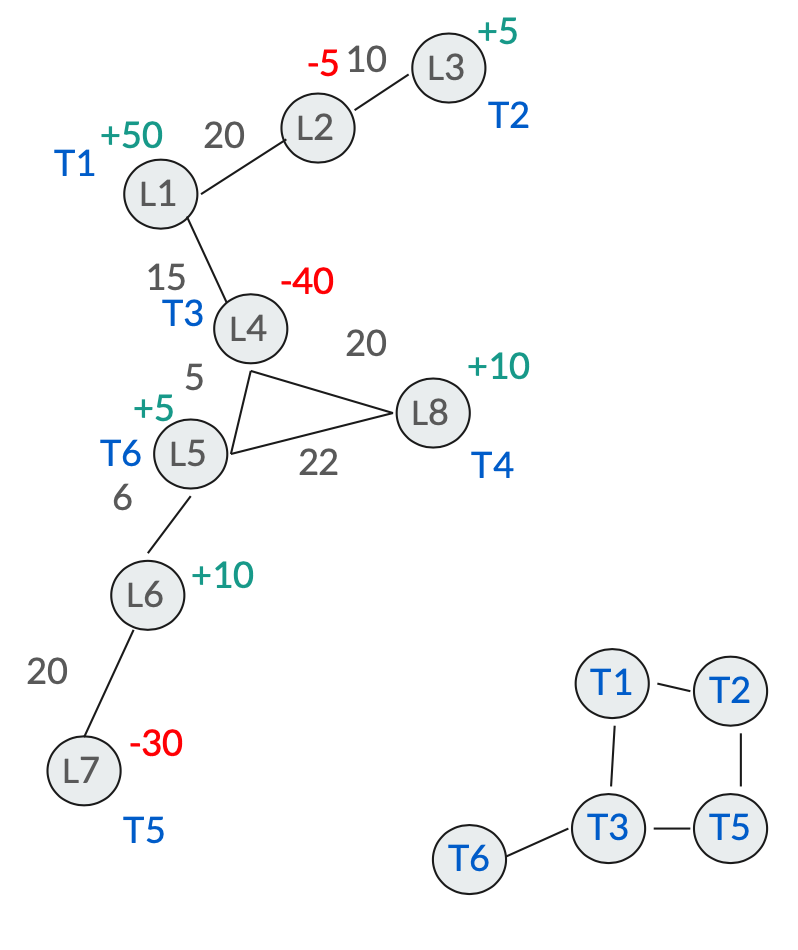

# Roman Trade Network 🏺

This project models a **spatial and social network** for Roman pottery trade using **graph theory**. It allows traders to find the shortest routes, optimize supply and demand, and simulate trading.

## Features ✨
- **Graph-based spatial network**: Locations connected via roads.
- **Trader social network**: Traders exchange information.
- **Shortest path calculation**: Uses Dijkstra's algorithm.
- **Optimized trading**: Ensures efficient supply and demand distribution.
- **Iterative trading**: Simulates multiple trading rounds.

## 📌 How It Works

This project simulates a **trade network** where traders move pottery between locations based on **supply and demand**. The system is modeled using **graph theory**, where:

- **Locations** are represented as nodes.
- **Roads** between locations are edges with distances.
- **Traders** operate within a social network to exchange information and goods.

The program determines the best **trade routes** and **optimizes transactions** to balance supply and demand.

---

### **1️⃣ Example Input Data**

The program operates using **structured input data**, which includes a **spatial network**, **supply and demand status**, **trader locations**, and **trader networks**.

Below is an example of how the input data is structured in `main.py`:

```python
# Road network between locations
spatial_network1 = [('L1', [('L4', 15), ('L2', 20)]), 
                    ('L2', [('L3', 10), ('L1', 20)]), 
                    ('L3', [('L2', 10)]), 
                    ('L4', [('L5', 5), ('L1', 15), ('L8', 20)]), 
                    ('L5', [('L4', 5), ('L6', 6), ('L8', 22)]), 
                    ('L6', [('L5', 6), ('L7', 20)]), 
                    ('L7', [('L6', 20)]), 
                    ('L8', [('L4', 20), ('L5', 22)])]

# Supply and demand of pottery at each location
status1 = {'L1': 50, 'L2': -5, 'L4': -40, 'L3': 5, 'L5': 5, 'L8': 10, 'L6': 10, 'L7': -30}

# Trader locations (each trader is assigned to a specific location)
trader_locations1 = {'T1': 'L1', 'T2': 'L3', 'T3': 'L4', 'T4': 'L8', 'T5': 'L7', 'T6': 'L5'}

# Social network of traders (who can trade with whom)
trader_network1 = [('T1', ['T2', 'T3']), 
                   ('T2', ['T1', 'T5']), 
                   ('T3', ['T1', 'T5', 'T6']), 
                   ('T5', ['T2', 'T3']),
                   ('T6', ['T3'])]
```

## 📌 Trade Network Visualization

The diagram below illustrates how locations, roads, and traders interact:


